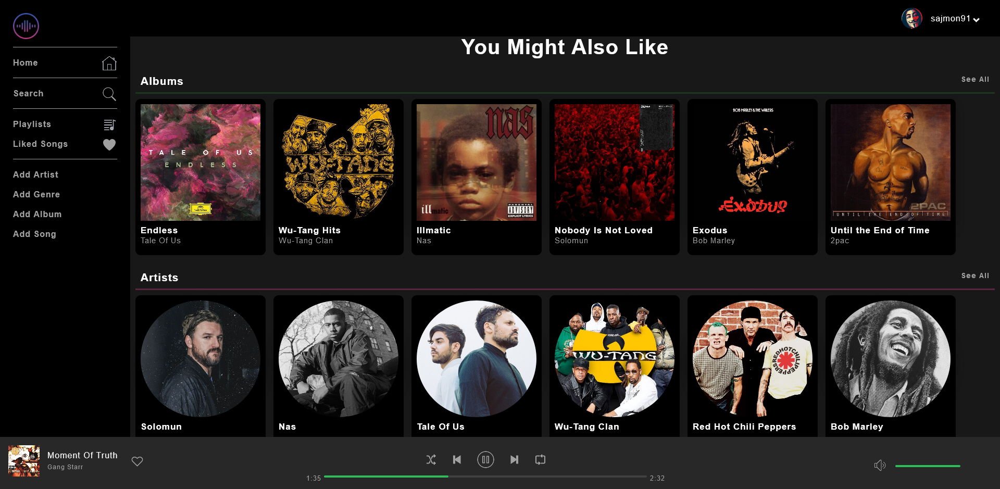
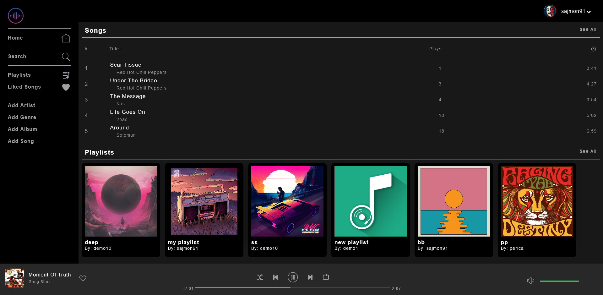
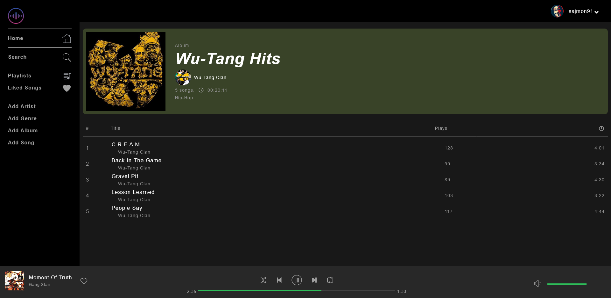

# Simonfy – Music Web Application

**Simonfy** is a full-stack music web application that allows users to stream, like, and download music. It includes a custom-built audio player, playlist management, and an admin panel for managing artists, albums, and song uploads.

## Screenshot

## Features

- **Users:** registration, login, and authentication
- **Music Player:** custom audio player for streaming
- **Interaction:** like songs, download tracks, create and manage playlists
- **Admin Panel:** manage artists, albums, and song uploads

## Built With

- **Frontend:** HTML5, CSS3, JavaScript
- **Backend:** PHP, MySQL, PDO
- **Communication:** AJAX

## Installation / Setup

1. Clone the repository
2. Import the database (SQL file - `app\db\spotify_clone.sql`) into MySQL
3. Configure `app\include\config.php` (database credentials and base URL)
4. Start your local server (WAMP, XAMPP, Laragon)
5. Open the application in your browser
